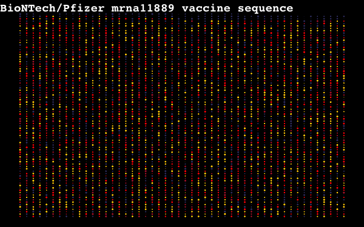

# COVID19 visulizations

This repository contains code for Visualizing COVID19 meta data from public sources

## COVID19 articles in bioRxiv and medRxiv

## Dynamics of COVID19 cases in Germany

## BioNTech/Pfizer mrna11889 vaccine sequence

### Requiremnets

1. [data.table](https://github.com/Rdatatable/data.table)
2. [jsonlite](https://cran.r-project.org/web/packages/jsonlite/index.html)
3. [ImageMagick](https://imagemagick.org/index.php) : Linux and macOS have this installed.
